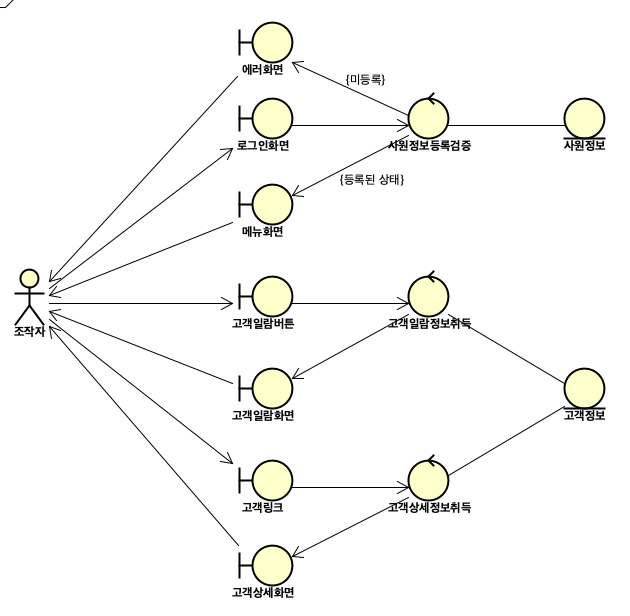

# Robustness Diagram

- 로버스트니스 분석을 한 결과로 얻어지는 다이어그램을 말한다.
  - 로버스트니스 분석: 시스템을 boundary, entity, control로 나누어 분석하여, 요구 모델을 견고하게 만드는 분석법
- UML로 정의된 13종류의 다이어그램에는 포함되지 않는다.
- 원칙적으로는 요건정의서를 기초로 그리지만, 순조로운 작업을 위해서는 유스케이스 기술서를 기초로 그리는 것이 좋다.

## 유스케이스와 유스케이스 기술서

### 유스케이스

- 액터가 요건을 달성하기위해 시스템 내부의 행위를 나타낸다.

### 유스케이스 기술서

- 유스케이스의 대본. 즉, 액터가 시스템과 주고 받는 것의 대본을 나타낸다.
- 사전조건, 사후조건, 기본흐름, 대체흐름, 예외흐름으로 구성된다.
  - 전부 있어야 하는 것은 아니다.

### 유스케이스 기술서 예제

- 유스케이스 명: 고객상세화면을 나타낸다.
- 액터: 조작자
- 사전조건: 로그인화면이 표시되어있다.
- 사후조건: 고객일람에서 선택한 고객의 상세화면이 표시되어있다.
- 기본흐름
  1. 조작자는 로그인 화면에 ID와 패스워드를 입력한다.
  2. 시스템은 입력된 ID와 패스워드의 조합이 사원정보에 등록되있는가 검증한다.
  3. 시스템은 메뉴화면을 표시한다.
  4. 조작자는 메뉴화면에 있는 \[고객일람\] 버튼을 클릭한다.
  5. 시스템은 고객정보로부터 고객일람정보를 취득하여, 고객일람화면을 표시한다.
  6. 조작자는 고객일람으로부터 임의의 고객 링크를 클릭한다.
  7. 시스템은 고객정보로부터 해당 고객의 상세정보를 취득하고, 고객상세화면을 표시한다.
- 대체흐름
  - 2a. ID와 패스워드의 조합이 사원정보에 등록되있지 않는 경우
  - 2a1. 시스템은 로그인 불가의 메세지를 에러화면에 표시한다.

## 로버스트니스 다이어그램의 작성

### 로버스트니스 다이어그램의 구성요소

- Actor
  - 시스템과 상호작용(interection)을 하는 시스템 외부의 존재를 나타낸다.
- boundary
  - 아래와 같은 요소를 나타낸다.
    1. 액터가 상호작용하는 화면이나 버튼
    2. 소프트웨어 요소(장표나 다른 시스템과의 인터페이스 등)
  - 즉, 액터와 시스템 내부의 경계에 있는 오브젝트 타입을 의미한다.
- control
  - boundary와 entity를 이어주고, 시스템이 행하는 처리를 정의하는 오브젝트 타입을 의미한다.
  - 추후 클래스의 메소드 구현부분이 된다.
- entity
  - 소프트웨어 시스템 내부에서 반영구적으로 관리하는 데이터 가리키는 오브젝트 타입을 의미한다.
  - 추후 데이터베이스의 테이블 후보가 된다.

- 요소 별 심볼과 요소 간의 연결 가능 유무

Role | Symbol | Actor | Boundary | Control | Entity
-----|--------|-------|----------|---------|--------
Actor |  | O | O | X | X
Boundary |  | O | Part/whole | O | X
Control |  | X | O | O | O
Entity |  | X | X | O | O

### 로버스트니스 다이어그램 예제

- `유스케이스 기술서 예제`를 가지고 로버스트니스 다이어그램을 작성

## 출처

- [ロバストネス図を活用したシステム設計](https://thinkit.co.jp/article/13487)
- [wikipedia:Entity-control-boundary](https://en.wikipedia.org/wiki/Entity-control-boundary#Robustness_diagram)