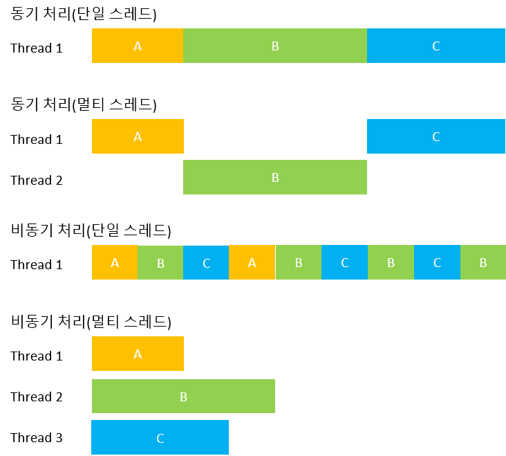

# Synchronous vs. Asynchronous execution

## Synchronous execution
- 동기적인(Synchoronous) 또는 동기된(Synchronized)이란 어떤 방법으로 연결되거나(connected), 의존적인(dependent) 것을 뜻한다.
- 다시 말해, 두 개의 동기적인 작업은 서로를 의식하며, 하나의 작업은 꼭 다른 하나의 작업의 상황에 따라 실행 된다.
- 일반적으로는 하나의 작업이 실행 될 때, 다른 하나의 작업은 정지된다. 실행되고 있던 작업이 완료 될 경우 다른 하나의 작업이 실행 된다.

## Asynchronous execution
- 비동기적인(Asynchronous)이란 두 개의 작업이 완전히 독립적이고, 서로의 작업을 고려하지 않은 체 실행 되는 것을 뜻한다.

## 멀티스레드와의 관계
- 동기 및 비동기는 멀티스레드와는 관계가 없으며, 동기 및 비동기는 단일 스레드 및 멀티 스레드에서 전부 구현 가능하다.

**Fig1. 스레드에 따른 동기 및 비동기 처리**

## 참고
[stackoverflow : Asynchronous vs synchronous execution, what does it really mean?](https://stackoverflow.com/questions/748175/asynchronous-vs-synchronous-execution-what-does-it-really-mean)